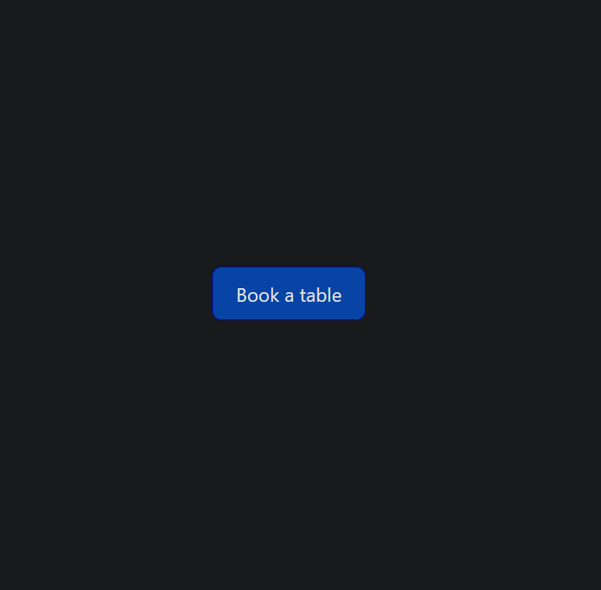
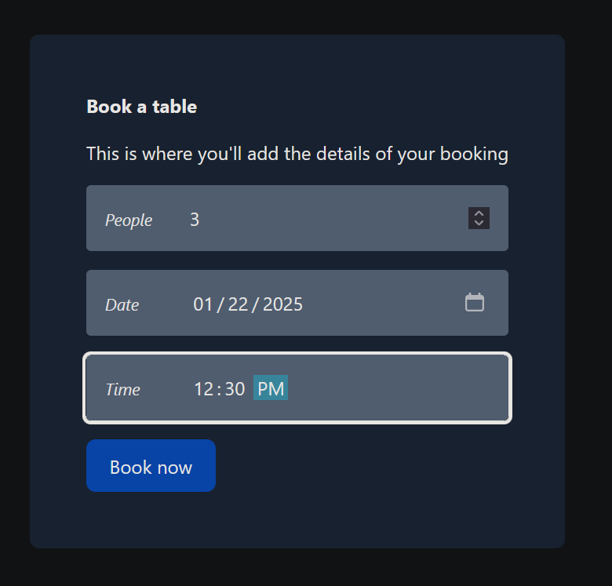
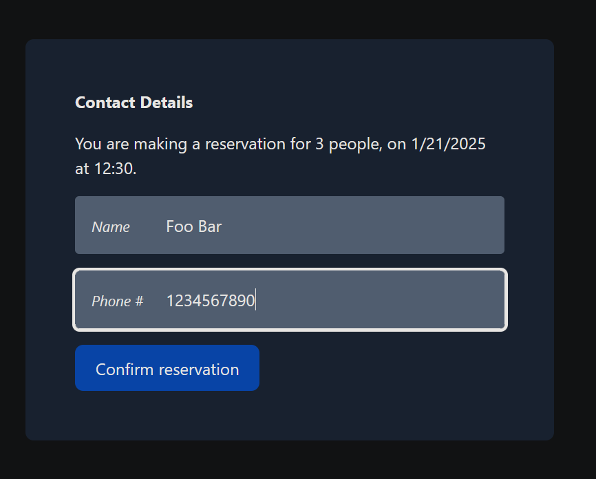

# React Practice - Reservation Widget

Implementation of [this](https://reactpractice.dev/exercise/build-a-restaurant-reservation-widget/)
reactpractive.dev exercise. Played around with [Headless UI](https://headlessui.com/) and [Tailwind](https://tailwindcss.com/)
in this one. Headless UI is very convenient, and I can see why people like Tailwind.

## Screenshots

